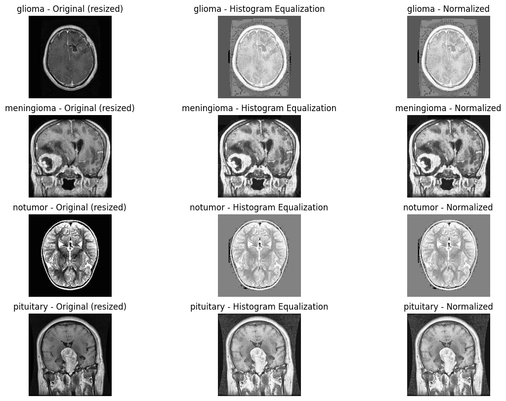
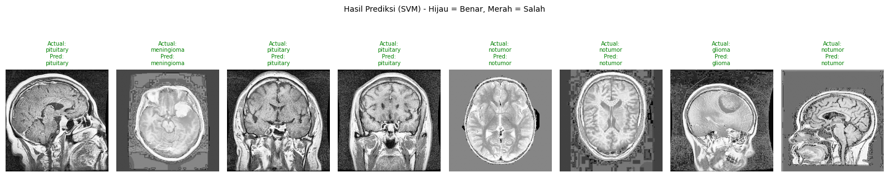

# Brain Tumor Classification ANN & SVM

Classifying brain tumors from MRI scans by comparing two machine learning
approaches an Artificial Neural Network (ANN) and a Support Vector Machine
(SVM) trained on the same preprocessed dataset for a fair, side-by-side
evaluation.

## Team

- Raphael Roybee Salim
- Robert Valdino Tjahyono
- Vallen Benaya Nangoi

## Dataset

[Brain Tumor Dataset — Segmentation and Classification](https://www.kaggle.com/datasets/indk214/brain-tumor-dataset-segmentation-and-classification)
(Kaggle), 4 classes: `glioma`, `meningioma`, `notumor`, `pituitary`.

| Split | glioma | meningioma | notumor | pituitary |
| --- | --- | --- | --- | --- |
| Train | 1321 | 1339 | 1595 | 1457 |
| Test | 300 | 306 | 405 | 300 |

## Pipeline

1. **Preprocessing** grayscale conversion, resize, histogram equalization,
   and normalization on every MRI scan before feature extraction.
2. **Feature extraction** images downscaled to 64x64 and flattened into a
   4096-dimensional feature vector shared by both models.
3. **Training** an ANN (Keras `Sequential`, dense + dropout + batch
   normalization layers, early stopping and LR scheduling) and an SVM
   (`SVC(C=10)`) are trained independently on the same splits.
4. **Evaluation** accuracy, per-class precision/recall/F1, and confusion
   matrix for both models.
5. **Interactive demo** a Gradio UI for uploading a scan and getting a live
   prediction from the selected model.

## Results

| Model | Accuracy |
| --- | --- |
| ANN | 93.06% |
| **SVM** | **96.03%** (best) |

**SVM classification report**

| Class | Precision | Recall | F1-score |
| --- | --- | --- | --- |
| glioma | 0.96 | 0.92 | 0.94 |
| meningioma | 0.92 | 0.92 | 0.92 |
| notumor | 0.98 | 1.00 | 0.99 |
| pituitary | 0.98 | 0.99 | 0.99 |

## Stack

Python · TensorFlow / Keras · scikit-learn · OpenCV · NumPy · Matplotlib ·
Gradio

## Running it

The notebook was built for Google Colab and downloads the dataset via
`kagglehub` on first run.

1. Open `brain_tumor_classification_ann_svm.ipynb` in Colab or Jupyter.
2. Run all cells top to bottom dataset download, preprocessing, training,
   evaluation, and the Gradio demo are each in their own labeled section.
